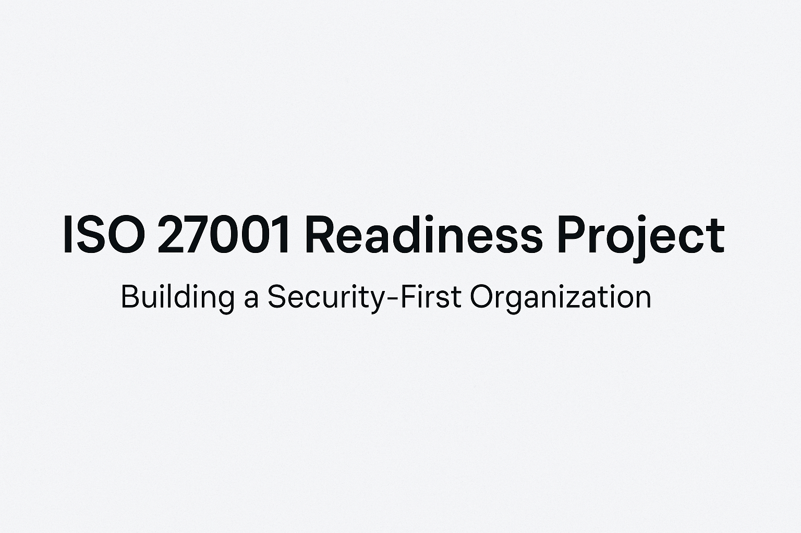

# ISO 27001 Readiness Project

---

## Overview

This repository contains a practical checklist and roadmap designed to guide organizations through the preparation and implementation steps for ISO/IEC 27001 certification.

It is organized around key phases — from leadership commitment to continual improvement — ensuring a structured, audit-ready Information Security Management System (ISMS).

---

## Why It Matters

Achieving ISO 27001 certification demonstrates an organization’s commitment to managing information security risks and protecting sensitive information.

This checklist and roadmap were built to streamline the preparation process, highlight critical focus areas, and support successful certification efforts.

---

## What's Included

- Leadership and Executive Support Framework
- Information Security Policy Development Guidance
- Risk Assessment and Risk Treatment Planning
- Statement of Applicability (SoA) Management
- Documentation and Operational Control Best Practices
- Internal Audits and Management Reviews
- Continual Improvement Planning Templates

---

## How to Use

1. Review each section of the Readiness Checklist ([iso_27001_readiness_checklist.md](./iso_27001_readiness_checklist.md)).
2. Work through the tasks systematically and document progress.
3. Track milestones and prepare for internal and external audits.
4. Regularly review and update your ISMS documentation as your organization evolves.

---

## ISO 27001 Certification Roadmap

This high-level roadmap outlines the recommended phases to achieve ISO/IEC 27001 certification:

| Phase | Description | Key Outputs |
|:------|:------------|:------------|
| **Phase 1: Initiation** | Secure leadership support, define scope, assign project resources. | Project Charter, Scope Statement |
| **Phase 2: Risk Assessment & Planning** | Identify information assets, assess risks, select controls, develop treatment plans. | Risk Assessment Report, Risk Treatment Plan |
| **Phase 3: ISMS Development** | Draft policies, procedures, and implement technical/organizational controls. | ISMS Documentation, Policies, Access Control Mechanisms |
| **Phase 4: Internal Training & Awareness** | Conduct employee security awareness training and role-based control training. | Training Materials, Training Logs |
| **Phase 5: Internal Audit** | Perform an internal audit to validate ISMS implementation and effectiveness. | Internal Audit Report, Corrective Action Plans |
| **Phase 6: Management Review** | Leadership formally reviews ISMS performance, risks, objectives, and audit results. | Management Review Records |
| **Phase 7: Certification Audit** | Engage an external auditor to conduct Stage 1 (Document Review) and Stage 2 (Implementation Review) audits. | Certification Readiness Assessment |
| **Phase 8: Continual Improvement** | Ongoing risk monitoring, corrective actions, and ISMS updates. | Continuous Improvement Logs |

---

## Quote

> "Great organizations don't just prepare for audits — they build a culture of security resilience."  
> — Neviar Rawlinson

---

## Author

**Neviar Rawlinson**  
IT Governance & Process Analyst | GRC | Risk Management | Process Optimization

- [LinkedIn Profile](https://www.linkedin.com/in/neviar-rawlinson-mba-itm-csm-23199616b/)
- [Portfolio Website](https://neviarrawlinson.github.io/)

---

